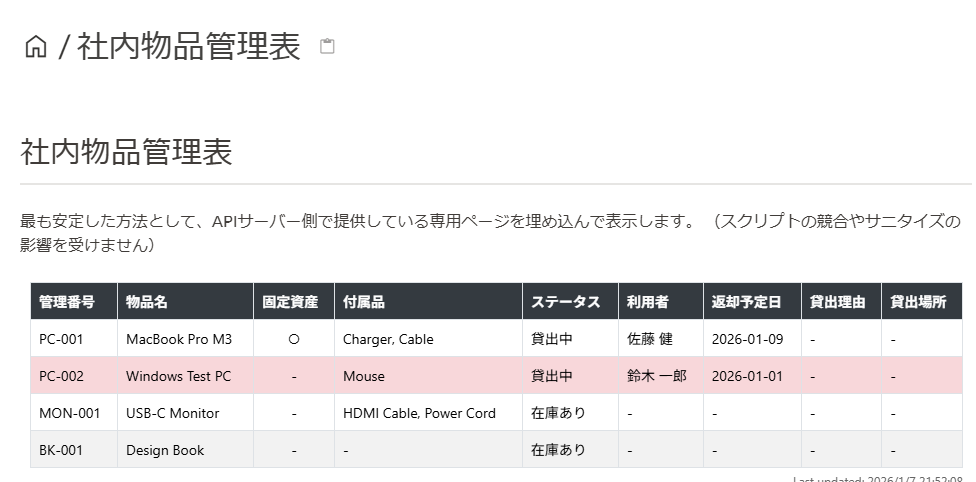
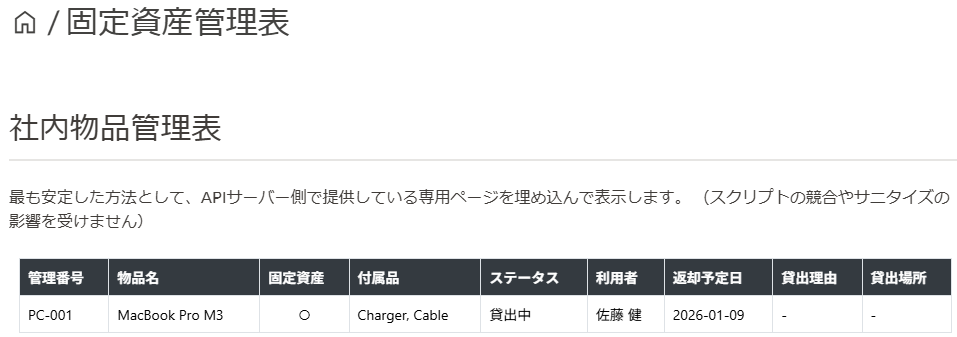

# 物品管理アプリケーション

部署内の備品の貸出・返却を管理するためのWebアプリケーションです。

## 📋 機能

- **備品管理**: 備品の登録、編集、削除
- **貸出・返却管理**: 備品の貸出・返却処理
- **ユーザー管理**: ユーザーの登録、ロール管理（admin/user）
- **メール通知**: 返却期限前のリマインド、期限超過の督促メール
- **管理画面**: SQLAdminによるGUI管理インターフェース
- **Growi連携**: Growi埋め込み用のWebコンポーネント提供

## 📚 ドキュメント

👉 [APIドキュメント](https://ctenopoma.github.io/item_manager/index.html)

## 貸出管理アプリケーション(GUI)

👉 [アプリ](https://github.com/ctenopoma/item_manager_client)

## 🛠️ 技術スタック

- **Backend**: Python 3.12+, FastAPI, SQLAlchemy
- **Database**: SQLite
- **パッケージ管理**: uv
- **コンテナ**: Docker

## 🚀 セットアップ

### ローカル開発

```bash
# 依存関係のインストール
uv sync

# サーバー起動
uv run uvicorn inventory_app.main:app --reload
```

### Docker

```bash
# ビルドと起動
docker compose up --build
```

サーバー起動後、`http://localhost:8000` でアクセスできます。

## 📁 プロジェクト構成

```
item_manager/
├── inventory_app/           # メインアプリケーション
│   ├── main.py              # FastAPIエントリーポイント
│   ├── models.py            # データベースモデル
│   ├── schemas.py           # Pydanticスキーマ
│   ├── crud.py              # CRUD操作
│   ├── admin.py             # SQLAdmin設定
│   ├── notification.py      # メール通知
│   ├── routers/             # APIルーター
│   └── static/              # 静的ファイル
├── docs/                    # Sphinxドキュメント
├── tests/                   # テストファイル
├── Dockerfile
├── docker-compose.yml
└── pyproject.toml
```

## 🔌 API エンドポイント

| エンドポイント       | メソッド | 説明           |
| -------------------- | -------- | -------------- |
| `/items`             | GET      | 全備品一覧取得 |
| `/items/{id}`        | GET      | 備品詳細取得   |
| `/items/{id}/borrow` | POST     | 備品を借りる   |
| `/items/{id}/return` | POST     | 備品を返却する |
| `/users`             | GET/POST | ユーザー管理   |
| `/admin`             | -        | 管理画面       |

詳細は起動後の `/docs` でSwagger UIを参照してください。

## web画面公開

- growi_table.html


- growi_fixed_assets_table.html


## 🧪 テスト

```bash
uv run pytest
```

## 📧 メール通知設定

管理画面（`/admin`）から以下を設定できます：

- **NotificationSettings**: SMTP設定、リマインド日数
- **EmailTemplates**: メールテンプレート（件名・本文）

## 📜 ライセンス

MIT License
